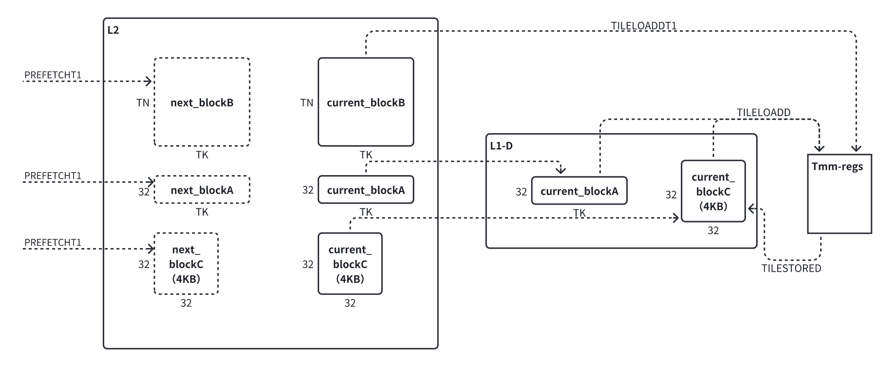
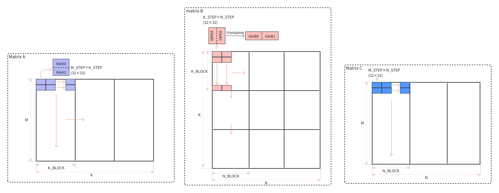

# AMX GEMM 手写算子实现

> 这是一个C++实现的手写AMX GEMM算子，支持多线程并行。
>
> 可以统计AMX运算部件的利用率，还可以查看硬件性能计数器。希望分析AMX GEMM的数据流瓶颈。

## 性能测试方法

1. 用 **CMake** 构建（顶层统一配置，两个变体一起编译）：

   `````bash
   cmake -S . -B build      # 配置一次，顺带生成 compile_commands.json（供 clangd）
   cmake --build build -j   # 编译
   `````

   产物：

   - `build/gemm-offline` --- 离线预打包版本（计时前一次性 pack 整个 A/B/C）
   - `build/gemm-online` --- 在线打包版本（打包融合进计算循环）

2. 可以从命令行传入一些参数，用来控制性能测试条件，或者控制GEMM算子的行为

   `````
   AMX GEMM Performance Test
   Usage: ./build/gemm-<variant> [OPTIONS]
   
   Options:
     -h,--help                   Print this help message and exit
     --config TEXT               从 TOML/INI 文件读取选项(CLI 可覆盖文件)
     -n,--node INT               Number of NUMA nodes
     -l,--core-list INT ...      Core list (e.g., 0,1,2,3)
     -f,--freq FLOAT             CPU Frequency in kHz
     -r,--round INT              Loop count
     --no-hwpf                   关闭硬件预取器(默认开启)
     --no-packA/B/C{false}       Disable packing for matrix A/B/C
     --dim-m/--dim-n/--dim-k TEXT  尺寸 sweep: 标量(1024)或区间(start:end:step)
     -o,--output TEXT            输出 CSV 日志路径
   `````

   sweep 三维 zip: 标量重复对齐最长维,多个区间须等长。例:
   `--dim-m 512:16384:256 --dim-n 512:16384:256 --dim-k 512:16384:256`(方阵),
   或 `--dim-m 32 --dim-n 32 --dim-k 64:4096:64`(固定 MN、扫 K)。

   两个变体各有专属参数：`gemm-offline` 额外有 `--no-swpfA/B/C`（关软件预取）；
   `gemm-online` 额外有 `--MC/--NC/--KC`（调 cache blocking）和 `--profile-single`（分阶段计时，额外输出 `*-stages.csv`）。

   输出为 **CSV**（默认 `gemm-i8-<核数>core.csv`，含表头 + 完整 config 列），
   可直接用 pandas 读取，也可交给 `tools/plot_*.py` 绘图。

3. 跑测试统一用 `scripts/bench.sh`（它负责锁频 + 绑核 + perf，并用 trap 保证测试结束/中断/失败后频率一定被解锁）。

   **关注点分离**：所有实验参数（freq/cores/dim/pack/MC…）写在一份 **TOML** 里，binary 与 bench.sh 共享；
   bench.sh 自己的 CLI 只留编排项（选变体/模式/perf 事件）。参考模板 [bench.toml](bench.toml)。

   `````bash
   # 编辑 bench.toml 设定 freq / cores / round / dim-* 等，然后:
   scripts/bench.sh -v online  --config bench.toml            # 按 TOML 跑
   scripts/bench.sh -v offline --config bench.toml -m perf    # 加 perf stat
   scripts/bench.sh -v online  --config bench.toml --dry-run  # 只预览命令
   scripts/bench.sh -v online  --config bench.toml -- -r 5    # -- 后临时覆盖 binary 参数
   `````

   bench.sh 的 CLI 选项（编排层）：

   - `-v, --variant offline|online` --- 选哪个可执行文件（必需）
   - `--config <toml>` --- 实验参数文件（必需）
   - `-m, --mode run|perf` --- `perf` 会在 `run` 基础上挂 **perf** 统计性能计数器
   - `--no-lock` / `--no-sudo` / `--dry-run` --- 分别跳过锁频 / 不加 sudo / 只打印不执行

   TOML 里 bench.sh 关心的键：`freq`（kHz，锁频用，与 binary 算利用率同源）、
   `cores`（核规格，支持 `"0-7"`）、`node`（可选，设了走 numactl）、
   `events`（perf 事件**数组**，如 `["cycles", "instructions"]`，不用重复写 `-e`）。其余键都是 binary 的实验参数。

   频率的单独锁定/解锁也可直接用 `scripts/freq.sh lock <khz>` 和 `scripts/freq.sh unlock`（底层是 **cpupower**）。

   perf 事件用 `-e` 传入。不过由于硬件性能计数器数量有限，建议同时统计 2~4 个事件。下面有一些比较有用的perf事件：

      `````
      -e cycles -e instruction
      
      # 测 AMX 指令使用情况
      # 			 -e exe.amx_busy
      # 			 -e amx_ops_retired.int8
      
      # L1D 缓存相关事件
      #            -e l1d.hwpf_miss
      # 			 -e l1d.replacement
      #            -e l1d_pend_miss.pending
      
      # L2 缓存相关事件
      # 			 -e l2_request.all -e l2_request.miss\
      #            -e l2_rqsts.references -e l2_rqsts.miss\
      # 1️⃣ Demand Data Reads（普通 load/store）
      #            -e l2_rqsts.all_demand_references -e l2_rqsts.all_demand_miss\
      #            -e l2_rqsts.all_demand_data_rd -e l2_rqsts.demand_data_rd_hit -e l2_rqsts.demand_data_rd_miss\
      # 2️⃣ RFO（store miss → Read For Ownership）
      #            -e l2_rqsts.all_rfo -e l2_rqsts.rfo_hit -e l2_rqsts.rfo_miss\
      # 3️⃣ Instruction fetch（code read）
      #            -e l2_rqsts.all_code_rd -e l2_rqsts.code_rd_hit -e l2_rqsts.code_rd_miss\
      # 4️⃣ 预取（HW / SW prefetch）
      #            -e l2_rqsts.all_hwpf -e l2_rqsts.hwpf_miss\
      #            -e l2_rqsts.swpf_hit -e l2_rqsts.swpf_miss
      # 5️⃣ 测 prefetch 的有效性
      #            -e l2_lines_out.useless_hwpf
      # 6️⃣ 估计 L2 bandwidth
      #            -e l2_lines_in.all
      # 7️⃣ 判断 L2 写回压力
      #            -e l2_lines_out.non_silent -e l2_lines_out.silent
      
      # L3 缓存相关事件
      # 1️⃣ L3 request counter（demand-only, 普通 load/store）
      #            -e longest_lat_cache.reference -e longest_lat_cache.miss
      # 2️⃣ retired load 中 hit L3 的不同情况
      #            -e mem_load_l3_hit_retired.xsnp_none (Load 在 L3 命中，并且不需要 snoop)
      #            -e mem_load_l3_hit_retired.xsnp_no_fwd (L3 hit，但需要 snoop 其他 core，未 forward)
      #            -e mem_load_l3_hit_retired.xsnp_fwd (L3 hit，但实际数据来自跨核 HitM forward)
      #            -e mem_load_l3_hit_retired.xsnp_miss (L3 hit，但 snoop miss（仍然是 L3 命中）)
      # 3️⃣ retired load 中 miss L3 的不同情况(NUMA相关！)
      #            -e mem_load_l3_miss_retired.local_dram (L3 miss → 本地 DRAM)
      #            -e mem_load_l3_miss_retired.remote_dram (L3 miss → 远端 DRAM)
      #            -e mem_load_l3_miss_retired.remote_hitm (L3 miss → 数据从远端 core 的 cache（Modified）forward)
      #            -e mem_load_l3_miss_retired.remote_fwd (L3 miss → 数据从远端 core 的 cache（Shared/Exclusive）forward)
      #            -e mem_load_l3_miss_retired.remote_pmm (L3 miss → Intel Optane PMM)
      `````

## 算子优化方案

在 2A2B4C 分配 tmm 寄存器的基础上，我们还加入了**数据分块、软件预取、数据重排**等优化手段，来提高算子对 AMX 部件的利用率。

### 数据分块

**对于AMX数据流来说，L2 是最关键的一级Cache**。L1-D 只有48KB，如果所有的Tile数据都经过L1-D，不仅是放不下，还会导致数据污染，让标量流水线（处理循环控制、地址计算的部分）疯狂发生L1 Miss。而L3又带宽太低、延迟太高。只有L2是容量和吞吐带宽的“甜点区”。

Intel针对AMX做出的最重要的架构优化就是**L1 Bypass**，支持直接从L2加载数据到Tile寄存器。

所以为了充分利用L2的空间，我们需要对大矩阵进行数据分块，让分块后的数据在计算时能够驻留在L2，减少L2 Miss的次数。同时，为了掩盖L3/内存延迟，数据分块在L2中还需要做Double Buffering或Ping-Pong Buffer，不管是由软件层面显式的预取，或者由硬件预取器去实现。L2中要包含当前计算的分块+下一轮预取的分块。

基于上面的考虑，我们设计的amx-gemm算子的数据流是这样的：A & C 进入L1-D，B 驻留在L2。



这样核心循环中两条TILELOADD+两条TILELOADDT1，提供的带宽能让AMX接近全速运行。

L2-blocking的大小是这样设计的：**TN** **= 512, TK = 1280**.

- L2中矩阵数据的Working Set大小是 ~1.33MB，留出足够的空间给指令代码、栈和其他开销；
- L1-D中矩阵数据的Working Set大小是 44KB。

### 软件预取

**我们分块算法的关键在于降低L2的Miss Rate。** 所以我们需要尽可能地保障下一轮要用到的数据分块在被使用之前已经被预取到L2中。除了依赖L2的硬件预取器，我们还可以进行软件预取。

在gemm循环中插入预取指令：


### 数据重排

我们发现，当N的大小取1024的倍数时，L2命中率会有一个明显的下降。这是因为L2命中率还会受到其相联度的影响！L2是16路组相联结构，而矩阵B、C的每一行相同位置的元素由于间隔是(2^n)B，更容易落在同一个Set中，这样就极易导致Conflict Miss，预取的数据又被替换出去了。

我们可以将矩阵数据在计算之前进行重排，**将strided tileload变成dense tileload**，即原来分布在不同行中要加载的数据按照访问顺序紧密排列。这样就能完全消除L2相联度的限制，同时也更有利于L2硬件预取器发挥最大效果。



