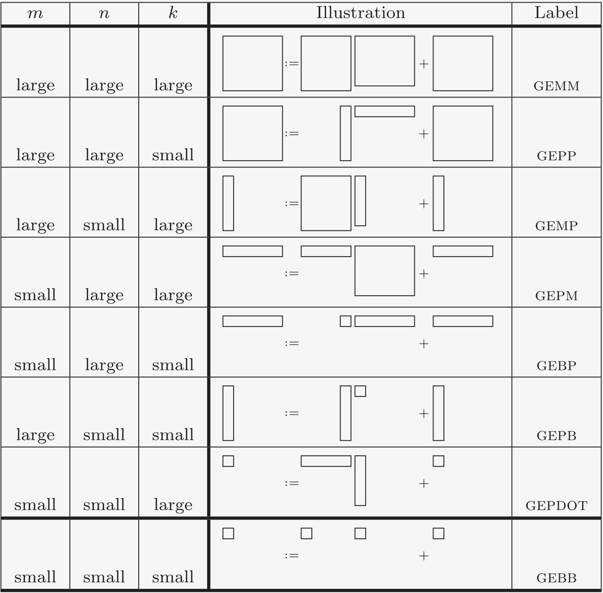
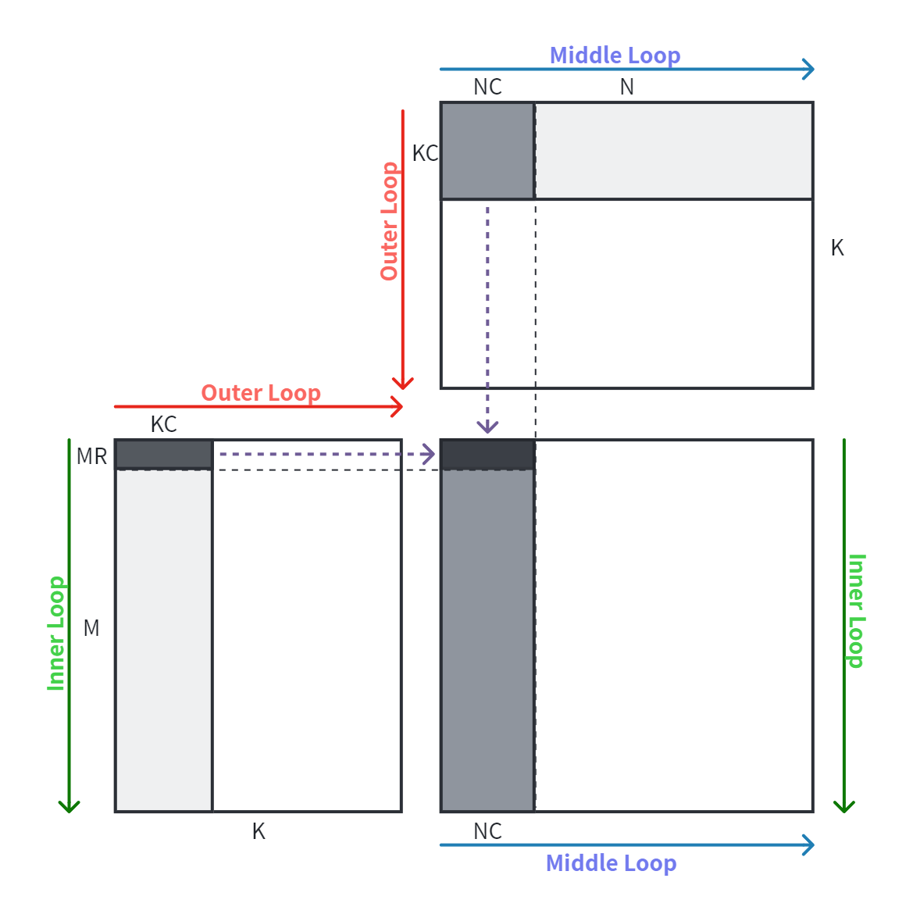
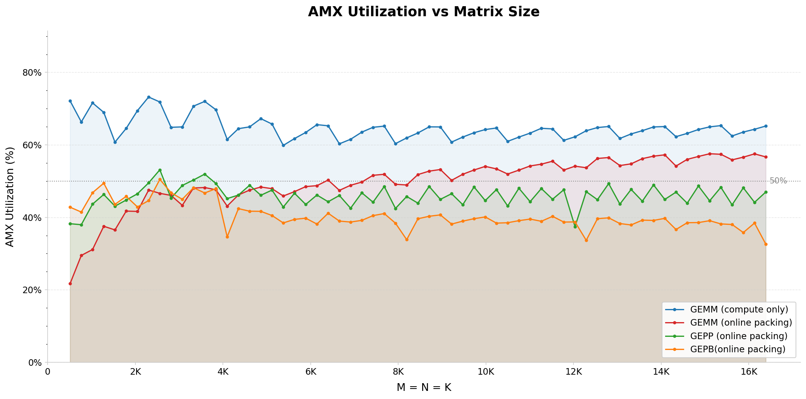

我们从 [Anatomy of high-performance matrix multiplication](https://dl.acm.org/doi/10.1145/1356052.1356053) 这篇了论文集成了分析框架。GEMM 负载按照 M/N/K 尺寸大小可以分成下面 8 种情形。

这里 large 与 small 的划分是相对于 Tile 分块大小而言的，而 Tile 分块大小又是根据片上 SRAM（也就是 CPU 的 cache）大小来确定的。



我们对数据的分块命名规则是这样的：

- 假设有一个大矩阵（M✕N），我们称为 Matrix 
- 对 Matrix 在一个维度上按 Cache Block Size 进行划分，会得到一个个 Panel，每一个 Panel 是一个“长条”形状的数据块（MC✕N, 或者 M✕NC）
- 对一个 Panel，在“更长”的方向上按 Cache Block Size 进行划分，会得到一个个 Block，每一个 Block 是一个“方块”形状的数据块（MC✕NC）
- 对一个 Panel，在“更长”的方向上如果按 Register Block Size 进行划分，会得到一个个 Strip，每一个 Strip 是一个“细长的条带”（MR✕NC，或者MC✕NR）

## 循环顺序

总体上分为 3 条 Routine:

1. **Routine1: GEMM => GEPP => GEPB => GESB**

    这里三层循环的顺序是 K - N - M，最终规约到 GESB kernel。

    每一个 GESB kernel 计算的所有数据都在 SRAM 中（StripA/C 在 L1，BlockB 在 L2），中间不需要与 L3/DDR 交换数据。

     

2. **Routine2: GEMM => GEPP => GEBP => GEBS**

    这里三层循环的顺序是 K - M - N，最终规约到 GEBS kernel。

    同样，每一个 GEBS kernel 计算的所有数据都在 SRAM 中（StripB/C 在 L1，BlockA 在 L2），中间不需要与 L3/DDR 交换数据。

     

3. Routine3: GEMM => micro-kernel （仅在 GEPDOT 情形下退化）

     

## Pack/Unpack 策略

- Pack: 对分块数据重排，使其在内存中连续排列；
- Unpack: 将连续排列的分块数据按照原始 layout 写回内存。

我们对分块数据 Pack/Unpack 的原则是**避免对同一块数据重复进行 Pack/Unpack。** 这样 Pack/Unpack 的总数据量就是整个矩阵的大小。

在这个基础上，我们可以考虑 Pack/Unpack 相对于矩阵乘计算的开销：

1. Pack A: MK / MNK = 1/N，说明 N 越大，Pack A 的开销相对越小。
2. Pack B: NK / MNK = 1/M，说明 M 越大， Pack B 的开销相对越小。
3. Unpack C: MN / MNK = 1/K，说明 K 越大，Unpack C 的开销相对越小。

> Pack/Unpack 的策略：
>
> 1. **避免对同一****块数据****重复进行 Pack/Unpack；**
> 2. Pack/Unpack 的收益要看矩阵大小：
>    1. 如果 M 小，那 Pack B 的收益就会小，我们就不 Pack B
>    2. 如果 N 小，那 Pack A 的收益就会小，我们就不 Pack A
>    3. 如果 K 小，那 Unpack C 的收益就会小，我们就不 Unpack C

## Packed Buffer 分配策略

online kernel 可通过 `--buffer-allocation auto|regular|huge` 控制 packed Buffer：

- `regular`：使用 `aligned_alloc` 分配，仅保证数据地址 64B 对齐，不主动请求 THP。
- `huge`：建立 2MB 对齐的匿名映射并调用 `MADV_HUGEPAGE`；分配或 advice 失败时报错。
- `auto`：当 4KB 页数超过本机一级 load DTLB 的 64 项，并且向上取整到 2MB 后的
  内存放大不超过 4 倍时选择 huge page 路径，否则选择 regular 路径。默认 640KB 的
  `KC×NC` block 会选择 huge page 路径，512KB 以下的 Buffer 选择 regular 路径。

THP 要求底层映射包含 2MB 对齐的完整区间，但返回给 kernel 的数据指针只需保持
64B 对齐。分配器会在 2MB 映射内部加入 cache-line 对齐的着色偏移，避免多个 Buffer
都从相同的 L1/L2 cache set 起始。CSV 中的 `bufferAllocation` 记录生效的分配策略；
Linux 最终是否成功建立 THP 仍需用 `/proc/<pid>/smaps` 的 `AnonHugePages` 验证。

当前 `auto` 只对单线程测试启用。多线程测试会在入口处解析为 `regular`，避免每个
block 独立持有的 Buffer 都至少消耗一个 2MB THP；显式指定 `huge` 仍可用于多线程实验。

## GEMM (large M, large N, large K)

- Routine1: GEMM => GEPP => GEPB => GESB

```Plain
Alloc buffer for MatrixC, PanelA, BlockB
for kc in range(0, K, KC):
    for nc in range(0, N, NC):
        pack blockB into buffer
        for i in range(0, M, MR):
            if nc = 0, pack stripA into buffer
            compute stripC += stripA x blockB(GESB, A,B,C both dense layout)
unpack matrixC from buffer
```

GEPP (large M, large N, small K)

- Routine1: GEMM => GEPP => GEPB => GESB

```Plain
Alloc buffer for PanelA, BlockB
for kc in range(0, K, KC):
    for nc in range(0, N, NC):
        pack blockB into buffer
        for i in range(0, M, MR):
            if nc = 0, pack stripA into buffer
            compute stripC += stripA x blockB(GESB, A,B dense, C strided)
```

## GEMP (large M, small N, large K)

- Routine1: GEMM => GEPP => GEPB => GESB

```Plain
Alloc buffer for MatrixC, BlockB
for kc in range(0, K, KC):
    for nc in range(0, N, NC):
        pack blockB into buffer
        for i in range(0, M, MR):
            compute stripC += stripA x blockB(GESB, B,C dense, A strided)
unpack matrixC from buffer
```

## GEPM (small M, large N, large K)

- Routine2: GEMM => GEPP => GEBP => GEBS

```Plain
Alloc buffer for MatrixC, BlockA
for kc in range(0, K, KC):
    for mc in range(0, M, MC):
        pack blockA into buffer
        for j in range(0, N, NR):
            compute stripC += blockA x stripB(GEBS, A,C dense, B strided)
unpack matrixC from buffer
```

## GEBP (small M, large N, small K)

- Routine2: GEMM => GEPP => GEBP => GEBS

```Plain
Alloc buffer for BlockA
for kc in range(0, K, KC):
    for mc in range(0, M, MC):
        pack blockA into buffer
        for j in range(0, N, NR):
            compute stripC += blockA x stripB(GEBS, A dense, B,C strided)
```

## GEPB (large M, small N, small K)

- Routine1: GEMM => GEPP => GEPB => GESB

```Plain
Alloc buffer for BlockB
for kc in range(0, K, KC):
    for nc in range(0, N, NC):
        pack blockB into buffer
        for i in range(0, M, MR):
            compute stripC += stripA x blockB(GESB, B dense, A,C strided)
```

## GEPDOT (small M, small N, large K)

- Routine3: GEMM => micro-kernel

```Plain
Alloc buffer for MatrixC
for i in range(0, M, MR):
    for j in range(0, N, NR):
        tilezero 4 tileC
        for k in range(0, K, KR):
            micro-kernel(4 tileload + 4 tdp)
        tilestore 4 tileC
unpack matrixC from buffer
```


## 一些测试结果

GEMM 下 ABC 全部做 packing/unpacking，每一部分的开销变化


M=N=K，对比 GEMM/GEPP/GEPB 三种实现策略的性能


